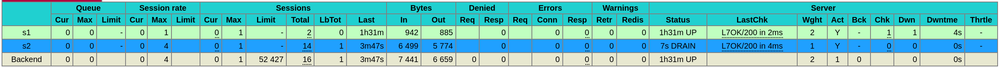
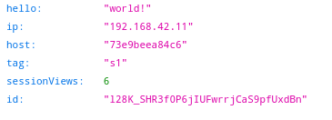
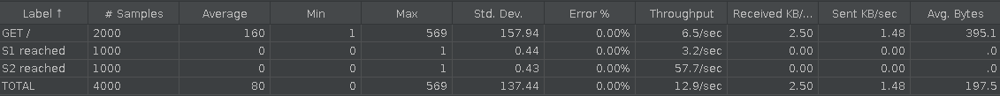
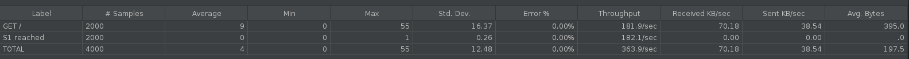
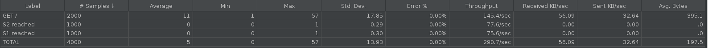

# AIT Load Balancing 

> Authors: Doran Kayoumi, Jérôme Arn, Quentin Saucy

## Introduction 

In this laboratory, we will have fun and discover how HAProxy works in a simple HTTP infrastructure using different load balancing policies.

## Task 1: Install the tools

#### 1. Explain how the load balancer behaves when you open and refresh the URL http://192.168.42.42 in your browser. Add screenshots to complement your explanations. We expect that you take a deeper a look at session management.

HAProxy' balancing strategy is `Round Robin`, which means that each time a request is made, it will be forwarded to a different server.

| First request               | Second request              |
| --------------------------- | --------------------------- |
|  |  |

If we take a look at the request made by the client makes, we will see that it transmits the cookie `NODESESSID` that it received after it's previous request. But, since we're using a `Round Robin` strategy, the request will be handled by a different server. When said server will receive the request, it won't recognize the cookie the user transmitted (since it doesn't have any session with the given id), thus it will create a new session and return the new `NODESESSID` to the client.

> Note: If it's the first time that the client makes a request, there won't be any cookies transmitted!

| Request                            | Response                            |
| ---------------------------------- | ----------------------------------- |
|  |  |

#### 2. Explain what should be the correct behavior of the load balancer for session management.

The correct behavior would be that the load balancer always forwards the request **with** a `NODESESSID` to the correct server. Such behavior is called `Sticky sessions`.

> Note: If it's the first time a client contacts the web app, the reverse proxy can route the request to any server!

#### 3. Provide a sequence diagram to explain what is happening when one requests the URL for the first time and then refreshes the page. We want to see what is happening with the cookie. We want to see the sequence of messages exchanged (1) between the browser and HAProxy and (2) between HAProxy and the nodes S1 and S2. Here is an example:

```sequence
Browser->>HAProxy: GET /
HAProxy->>S1: GET /
S1->>HAProxy: Response: application/json\n Set-Cookie NODESESSID=1
HAProxy->>Browser: Response: application/json\n Set-Cookie NODESESSID=1

Browser->>HAProxy: GET / \n Cookie: NODESESSID=1
HAProxy->>S1: GET / \n Cookie: NODESESSID=1
S1->>HAProxy: Response: application/json\n Set-Cookie NODESESSID=2
HAProxy->>Browser: Response: application/json\n Set-Cookie NODESESSID=2
```

> Note: We've added the name of the server in the cookie to show that after the second request, we have a new cookie that was generated by S2

#### 4. Provide a screenshot of the summary report from JMeter.

| Both nodes active                      | One node active                      |
| -------------------------------------- | ------------------------------------ |
|  |  |

## Task 2: Sticky sessions

1. **There is different way to implement the sticky session. One possibility  is to use the SERVERID provided by HAProxy. Another way is to use the  NODESESSID provided by the application. Briefly explain the difference  between both approaches (provide a sequence diagram with cookies to show the difference).**

   The difference between `SERVERID` and `NODESESSID` resides in who creates the cookie. The former is handled by HAProxy and the latter by the application.

   

   **With the application approach (i.e. `NODESESSID`):**

   At the first response, the application will send a new cookie to the client `NODESESSID=i12KJF2`. When passing through HAProxy, the name of the application  handling the client is prepended to said cookie `NODESESSID=s1~i12KJF2`.

   > Note: The prefix added by HAProxy uses a `~` as a separator which will be useful when the client makes a request.

   So now, when the client makes another request, it will contain the cookie that it previously received `NODESESSID=s1~i12KJF2`. Now when it passes through HAProxy, the prefix that it added is used to determine where to forward the request and is removed before the request is forwarded.

   ```sequence
   Client->>HAProxy: GET /
   HAProxy->>App: GET /
   App->>HAProxy: Response: application/json\n Set-Cookie NODESESSID=1
   HAProxy->>Client: Response: application/json\n Set-Cookie NODESESSID=App~1
   
   Client->>HAProxy: GET /\n Cookie: NODESESSID=App~1
   HAProxy->>App: GET /\n Cookie: NODESESSID=1
   App->>HAProxy: Response: application/json
   HAProxy->>Client: Response: application/json
   ```

   **With the HAProxy approach (i.e. `SERVERID`):**

   > Note: It the case of this laboratory, the application will always add a cookie `NODESESSID`. But, to simplify the explanations and the diagram for this approach, we've simply omitted it.

   At the first response, the application will send it's payload. When passing through HAProxy, a new cookie `SERVERID=s1` is added to the header which will indicate which server handled the request.

   So now, when the client makes another request, it will contain the cookie added by HAProxy `SERVERID=s1`. Now when it passes through HAProxy, it will directly be forwarded to the correct application.

   ```sequence
   Client->>HAProxy: GET /
   HAProxy->>App: GET /
   App->>HAProxy: Response: application/json 
   HAProxy->>Client: Response: application/json\n Set-Cookie: SERVERID=App
   
   Client->>HAProxy: GET /\n Cookie: SERVERID=App
   HAProxy->>App: GET /
   App->>HAProxy: Response: application/json 
   HAProxy->>Client: Response: application/json 
   ```

   > Note: When the reverse proxy forwards the response to the client the second time, it doesn't insert the `SERVERID` cookie since the client already knows it.

   For the rest of the laboratory, we'll be using the `SERERID` approach.

1. **Provide the modified `haproxy.cfg` file with a short explanation of the modifications you did to enable sticky session management.**

   ```sh
   backend nodes
   	# ...
   	
       # This line tells HAProxy to setup a cookie called SERVERID only if the user did not come with such cookie.
       cookie SERVERID insert indirect nocache
   	
   	# ...
   
   	#  provide the value of the cookie inserted by HAProxy. When the client comes back, then HAProxy knows directly which server to choose for this client.
       server s1 ${WEBAPP_1_IP}:3000 check cookie s1
       server s2 ${WEBAPP_2_IP}:3000 check cookie s2
   ```

2. **Explain what is the behavior when you open and refresh the URL http://192.168.42.42 in your browser. Add screenshots to complement your explanations. We expect that you take a deeper a look at session management.**

   The first time we access the application, HAProxy will redirect us to any server (a bit like if it was setup to use the `Round Robin` algorithm). The server that will handle our request, will create a new session for us and return the payload with the session id set in the cookie `NODESESSID`. Before the proxy sends the servers response to us, it will attach a new cookie `ServerID`. This extra cookie will allow the proxy to redirect any of other requests we make to the server that handled our very first request.

   > Note: If the `ServerID` cookie isn't present in the request made, the proxy won't know where to send the request and return to a `Round Robin` behaviour (i.e. send the request to which ever server is available).

   | First request               | Second request               |
   | --------------------------- | ---------------------------- |
   |  |  |

   As we can see, the server that handled the request and the id stay the same and that the number of `seesionViews` increased \o/ . Further proof that it was the sticky session that work and not dumb luck,  we can see the cookie `ServerID`  in the clients request.

   

4. **Provide a sequence diagram to explain what is happening when one requests the URL for the first time and then refreshes the page. We want to see what is happening with the cookie. We want to see the sequence of messages exchanged (1) between the browser and HAProxy and (2) between HAProxy and the nodes S1 and S2. We also want to see what is happening when a second browser is used.**

   **First request**:

   ```sequence
   Client->>HAProxy: GET /
   HAProxy->>S1: GET /
   S1->>HAProxy: Response: application/json\n Set-Cookie: NODESESSID=1
   HAProxy->>Client: Response: application/json\n Set-Cookie: NODESESSID=1 & SERVERID=S1
   ```

   **Request after refresh:**

   ```sequence
   Client->>HAProxy: GET /\n Cookie: NODESESSID=1 & SERVERID=S1
   HAProxy->>S1: GET / \n Cookie: NODESESSID=1
   S1->>HAProxy: Response: application/json
   HAProxy->>Client: Response: application/json
   ```

   **New Browser:**

   Cookies are stored in the browser, so if we change browsers, it's like we're contacting the service for the first time. 

5. **Provide a screenshot of JMeter's summary report. Is there a difference with this run and the run of Task 1?**

   No there aren't any differences with the run we did in Task 1.

   

- Clear the results in JMeter.
- Now, update the JMeter script. Go in the HTTP Cookie Manager and ~~uncheck~~verify that the box `Clear cookies each iteration?` is unchecked.
- Go in `Thread Group` and update the `Number of threads`. Set the value to 2.

7. **Provide a screenshot of JMeter's summary report. Give a short explanation of what the load balancer is doing.**

   

   When the threads perform their very first request, the load balancer will redirect them to a server using the `Round Robin` balancing strategy (e.g. Thread 1 to S1 and Thread 2 to S2). Afterwards, we can see that the load balancers `Sticky Session` policy is working correctly and that the requests are evenly split between both servers.

## Task 3: Drain mode

1. **Take a screenshot of the Step 5 and tell us which node is answering.**

   

   

   S2 answered the request. 

2. **Based on your previous answer, set the node in DRAIN mode. Take a screenshot of the HAProxy state page.**

   If we go on **/stats** we can see that s2 is in `Drain` mode. 

    

3. **Refresh your browser and explain what is happening. Tell us if you stay on the same node or not. If yes, why? If no, why?**

   Since we didn't clear our cookies (on our browser), we stayed on the same node. Which is totally normal, when a server is in `Drain` mode, it will still accept old sessions but it won't accept any new sessions.

   

4. **Open another browser and open `http://192.168.42.42`. What is happening?**

   

   Since this is the "first" time we're contacting the server, we're redirected to S1. As stated above, a node that is in `Drain` mode won't accept any new sessions.

5. **Clear the cookies on the new browser and repeat these two steps multiple times. What is happening? Are you reaching the node in DRAIN mode?**

   If we clear the cookies in "our" browser (i.e. the one that still has a connection with S2), we won't be able to reach it anymore. And clearing the cookies on the second browser doesn't change anything, we still can't reach S2. 

   | Our browser           | Browser 2             |
   | --------------------- | --------------------- |
   |  |  |

6. **Reset the node in READY mode. Repeat the three previous steps and explain what is happening. Provide a screenshot of HAProxy's stats page.**

   

   Now that **S2** is in `READY` mode, it will again accept new sessions. Which means that the `Round robin` and `Sticky session` policy will be able to again redirect request to S2.

   > If we refresh our browser, we will stay on S1 since it was the last node that handled our requests.
   >
   > 
   >
   > When accessing the server from a new browser, the load balancer will redirect us to the first available node. Here, we reached S2 (which is handy because it shows that it does accept  new requests)
   >
   > 
   >
   > By clearing our cookies and accessing the server again and again, we will simply go back and fort between the available node
   >
   > | First clear            | Second clear           |
   > | ---------------------- | ---------------------- |
   > |  |  |

7. **Finally, set the node in MAINT mode. Redo the three same steps and explain what is happening. Provide a screenshot of HAProxy's stats page.**

   

   Now that **S2** is in `MAINT` mode, we can try whatever we want, clearing our cookies using a different browser, we'll never be able to reach it because it's considered as "out of order".

   So as long as S2 is in `MAINT` mode, all the requests will be handled by S1.

   | Our browser           | Other browser         |
   | --------------------- | --------------------- |
   |  |  |

## Task 4: Round robin in degraded mode

1. **Be sure the delay is of 0 milliseconds is set on `s1`. Do a run to have base data to compare with the next experiments.**

   

   

2. **Set a delay of 250 milliseconds on `s1`. Relaunch a run with the JMeter script and explain what it is happening?**

   

   

   We can see that with 250 ms, the throughput of S1 drastically fell and that it slightly increased for S2. 

3. **Set a delay of 2500 milliseconds on `s1`. Same than previous step.**

   

   

   We can see that only S2 is handling requests. Since S1 has such a big latency, the load balancer considers it as **down**.

4. **In the two previous steps, are there any error? Why?**

   With a delay of 250 ms, there aren't any errors on the other hand, with a delay of 2500 ms HAProxy gives us an error. It's because S1 took more than 2 seconds to answer during the probe request so it's now considered as down.

   

5. **Update the HAProxy configuration to add a weight to your nodes. For that, add `weight [1-256]` where the value of weight is between the two values (inclusive). Set `s1` to 2 and `s2` to 1. Redo a run with 250ms delay.**

   ```
   backend nodes
   	# ....
       server s1 ${WEBAPP_1_IP}:3000 weight 2 check cookie s1
       server s2 ${WEBAPP_2_IP}:3000 weight 1 check cookie s2
   ```
   
   
   
   Even though S1 has a greater weight, the requests are evenly split between both nodes. Simply because the load balancer is using the `Sticky Session` policy.
   
   
   
6. **Now, what happened when the cookies are cleared between each requests  and the delay is set to 250ms ?**  

   Since the balancing strategy is `Round Robin` and that the cookies are being reset between each requests the sticky sessioness wont work and the request will balanced between each node. BUT, S1 has a greater weight, it will be getting more requests than S2 even though it takes longer to answer.

   

## Task 5: Balancing strategies

1. **Briefly explain the strategies you have chosen and why you have chosen them.**

   We've decided to go with the `source` and `leastconn` strategies. 

   <u>Source:</u>

   This strategy uses the source IP address hashed and divided by the total weight of the running servers to designate which server will receive the request. We chose to try this strategy it seemed interesting that, to some degree, it can handle sessions without the usage of cookies. 

   <u>Leastconn:</u>

   This one seemed interesting because it's mechanism is similar to a `round robin` policy except it into account server usage and prioritizes least used servers. What made use choose this is policy is that the documentation states that it isn't well suited for protocols such as HTTP. 

   > ... but is not very well suited for protocols using short sessions such as HTTP ...
   >
   > Source: http://cbonte.github.io/haproxy-dconv/2.3/snapshot/configuration.html#4-balance

   So we decided to try it out.

2. **Provide evidences that you have played with the two strategies (configuration done, screenshots, ...)**

   <u>Source:</u> 

   ```
   # ...
   backend nodes
       # Define the protocol accepted
       # http://cbonte.github.io/haproxy-dconv/2.2/configuration.html#4-mode
       mode http
   
       # Define the way the backend nodes are checked to know if they are alive or down
       # http://cbonte.github.io/haproxy-dconv/2.2/configuration.html#4-option%20httpchk
       option httpchk HEAD /
   
       # Define the balancing policy
       # http://cbonte.github.io/haproxy-dconv/2.2/configuration.html#balance
       balance source 
   
       # Automatically add the X-Forwarded-For header
       # http://cbonte.github.io/haproxy-dconv/2.2/configuration.html#4-option%20forwardfor
       # https://en.wikipedia.org/wiki/X-Forwarded-For
       option forwardfor
   
       # With this config, we add the header X-Forwarded-Port
       # http://cbonte.github.io/haproxy-dconv/2.2/configuration.html#4-http-request
       http-request set-header X-Forwarded-Port %[dst_port]
   
       # Define the list of nodes to be in the balancing mechanism
       # http://cbonte.github.io/haproxy-dconv/2.2/configuration.html#4-server
       server s1 ${WEBAPP_1_IP}:3000 check
       server s2 ${WEBAPP_2_IP}:3000 check
   ```

   When contacting the application for the first time, we can see that S2 handled our request. And if we refresh the browser it's still S2 handling our requests.

   | First request                            | Nth request                              |
   | ---------------------------------------- | ---------------------------------------- |
   |  |  |

   Even if we clear our cookies our use a different browser, it's still S2 that will handle our requests.

   | Cleared cookies                          | New browser                                |
   | ---------------------------------------- | ------------------------------------------ |
   |  |  |

   Testing with JMeter, we can see that only S2 is receiving requests!

   

   > Note: We configured JMeter to use 2 threads.

   To spice things up a little, we've updated the configuration and gave S1 a bigger weight to see if that would change anything.

   ```
   server s1 ${WEBAPP_1_IP}:3000 weight 2 check
   server s2 ${WEBAPP_2_IP}:3000 weight 1 check
   ```

   

   Running JMeter again we can see that it's now S1 handling all requests:

   

   This is too be expected since the hash is divided by the total weight of the running servers and by increasing the weight of S1 this value changed.

   <u>Leastconn:</u>

   ```
   backend nodes
       # Define the protocol accepted
       # http://cbonte.github.io/haproxy-dconv/2.2/configuration.html#4-mode
       mode http
   
       # Define the way the backend nodes are checked to know if they are alive or down
       # http://cbonte.github.io/haproxy-dconv/2.2/configuration.html#4-option%20httpchk
       option httpchk HEAD /
   
       # Define the balancing policy
       # http://cbonte.github.io/haproxy-dconv/2.2/configuration.html#balance
       balance leastconn
   
       # Automatically add the X-Forwarded-For header
       # http://cbonte.github.io/haproxy-dconv/2.2/configuration.html#4-option%20forwardfor
       # https://en.wikipedia.org/wiki/X-Forwarded-For
       option forwardfor
   
       # With this config, we add the header X-Forwarded-Port
       # http://cbonte.github.io/haproxy-dconv/2.2/configuration.html#4-http-request
       http-request set-header X-Forwarded-Port %[dst_port]
   
       # Define the list of nodes to be in the balancing mechanism
       # http://cbonte.github.io/haproxy-dconv/2.2/configuration.html#4-server
       server s1 ${WEBAPP_1_IP}:3000 check
       server s2 ${WEBAPP_2_IP}:3000 check
   ```

   When contacting the application for the first time, we can see that S2 handled our request. And if we refresh the browser we go back and fort between S1 and S2.

   | First request                               | Nth request                                 |
   | ------------------------------------------- | ------------------------------------------- |
   |  |  |

   Testing with JMeter, we can see that the requests are almost evenly split between both nodes but not exactly, we're not exactly sure why. We suspect that it's most likely due to the fact the `leastconn` is better suited when long sessions are expected (e.g. ldap, SQL, etc...)

   

   As we did with the `source` policy, we'll give S1 a bigger weight.

   ```
   server s1 ${WEBAPP_1_IP}:3000 weight 2 check
   server s2 ${WEBAPP_2_IP}:3000 weight 1 check
   ```

   Even with more weight on S1, the requests are almost evenly split between both nodes.

   

   Now to be totally crazy, we'll enable cookies to see how it works with the `leastconn` policy.

   > Note: We've removed the weights.

   ```
   # ...
   cookie SERVERID insert indirect nocache
   # ...
   server s1 ${WEBAPP_1_IP}:3000 check cookie s1
   server s2 ${WEBAPP_2_IP}:3000 check cookie s2
   ```

   And after running more JMeter tests, we can see that the `sticky session` isn't affected by the `leastconn` policy similarly to what happened with the `round robin` policy in previous tasks. This time, we can see that the requests are splited between both nodes because each thread has an cookie for himself.

   

   We can confirm the tests by performing request from a browser. After the first request, the policy forwards the request to the first available server and after refreshing the page, we're still handled by the same server

   | First request                                       | Nth request                                         |
   | --------------------------------------------------- | --------------------------------------------------- |
   |  |  |

   If we clear our cookies or use another browser, it's the same as if we did our first request.

   | Cleared cookies                                | New browser                                       |
   | ---------------------------------------------- | ------------------------------------------------- |
   |  |  |

3. **Compare the both strategies and conclude which is the best for this lab (not necessary the best at all).**

   These policies have different purposes, `source` is to have a kind of sticky session and `leastconn` to get the least used servers to be used more often. Having said that, they do have their own issues. As the documentation stated, `leastconn` is best suited when working with long sessions (e.g. sql, ldap, etc…) and it can be seen in this lab as it basically works as the `round robin` policy (a less efficient one) . Source on the other did seem interesting since it allowed to set up a sticky session without the usage of cookies, but (in the case of this lab) it did cause that all the requests were forwarded to only one server (which could cause an overload). 

   > Note: If take a larger scale example, `source` could be great if it's used internally (e.g. to access an intranet) as every machine have there own IP address. On the other hand, if we try and access an external resource, all the machines in the network will most likely pass trough a NAT and will have the same IP hence they will always access the same server which could lead to an overload.
   
   In sight of these issues, we believe that `leastconn` is the best solution for this laboratory.

## Conclusion 

After testing different load balancing policies, we now have a better understanding on how a reverse proxy works. We've also learnt (and understood) the differences between the types of cookies used for a sticky session (i.e. NODESESSIONID & SERVERID). Finally, we've discovered that certain policies can have the same behaviour under certain conditions (e.g. leastconn with short sessions protocols).
