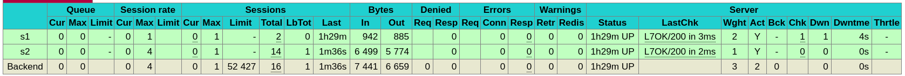

# AIT Load Balancing 

> Authors: Doran Kayoumi, Quentin Saucy, Jérôme Arn 

## Task 1: Install the tools

#### 1. Explain how the load balancer behaves when you open and refresh the URL http://192.168.42.42 in your browser. Add screenshots to complement your explanations. We expect that you take a deeper a look at session management.

The load balancer uses a `Round Robin` algorithm. Which means that each time a request is made, the reverse proxy will transmit the request to a different server.

| First request               | Second request              |
| --------------------------- | --------------------------- |
|  |  |

If we take a look at the request made by the client makes, we will see that it transmits the cookie `NODESESSID` that it received after it's previous request. But, since we're using a round robin reverse proxy, the request will be handled by a different server. When said server will receive the request, it won't recognize the cookie the user transmitted (since it doesn't have any session with the given id), so it will create a new session and return the new `NODESESSID` to the client.

> Note: If it's the first time that the client makes a request, there won't be any cookies transmitted!

| Request                            | Response                            |
| ---------------------------------- | ----------------------------------- |
|  |  |

#### 2. Explain what should be the correct behavior of the load balancer for session management.

The correct behavior would be that the load balancer always sends the request **with** a `NODESESSID` to the correct server. Such behavior is called `Sticky sessions`.

> Note: If it's the first time a client contacts the web app, the reverse proxy can route the request to any server!

#### 3. Provide a sequence diagram to explain what is happening when one requests the URL for the first time and then refreshes the page. We want to see what is happening with the cookie. We want to see the sequence of messages exchanged (1) between the browser and HAProxy and (2) between HAProxy and the nodes S1 and S2. Here is an example:


> Note: We've added the name of the server in the cookie to show that after the second request, we have a new cookie that was generated by S2

#### 4. Provide a screenshot of the summary report from JMeter.

| Both nodes active                      | One node active                      |
| -------------------------------------- | ------------------------------------ |
|  |  |

## Task 2: Sticky sessions

1. There is different way to implement the sticky session. One possibility  is to use the SERVERID provided by HAProxy. Another way is to use the  NODESESSID provided by the application. Briefly explain the difference  between both approaches (provide a sequence diagram with cookies to show the difference).

   ```sequence
   Browser->>ha: Normal Request
   ha->>S1/S2: Normal Request forward to server \n with round robin
   S1/S2->>ha: S1/S2 add NODESESSID 
   ha->>Browser: cookie NODESESSID \n ha add ServerID cookie
   
   ```

   Dans le projet de base le NODESESSID est activé mais le load balancing ne fonctionne pas. Cela peut être expliqué car le NODESESSID sert juste à l'application à stocker des informations et à être statefull. Mais il n'indique pas à ha proxy vers quelle machine diriger la requête. 

   SERVERID sert à Ha proxy à savoir vers quelle serveur envoyer la requête. Si il n y a pas de cookie, dans le cas de notre labo, il choisira avec la méthode round robin.

   

2. Provide the modified `haproxy.cfg` file with a short explanation of the modifications you did to enable sticky session management.

   ```sh
   backend nodes
       mode http
       option httpchk HEAD /
       balance roundrobin
       # indique que nous allons utiliser les cookies serverID sans cache l'option indirect indique que si le client a déjà 	un cookie le server n'en remet pas un 
       cookie SERVERID insert indirect nocache
   
       option forwardfor
       http-request set-header X-Forwarded-Port %[dst_port]
   
   	# Set les différents noeuds vers lesquels envoyés les requêtes avec validation des cookies pour chacun des noeuds 		respectifs
       server s1 ${WEBAPP_1_IP}:3000 check cookie s1
       server s2 ${WEBAPP_2_IP}:3000 check cookie s2
   ```

3. Explain what is the behavior when you open and refresh the URL http://192.168.42.42 in your browser. Add screenshots to complement your explanations. We expect that you take a deeper a look at session management.

   Quand on arrive sur le navigateur sans avoir de cookie, on est sur le serveur 2. si on refresh, on reste sur le même serveur car on a un cookie. Si on efface les cookies, on passe sur le serveur 1. 

   

4. Provide a sequence diagram to explain what is happening when one requests the URL for the first time and then refreshes the page. We want to see what is happening with the cookie. We want to see the sequence of messages exchanged (1) between the browser and HAProxy and (2) between HAProxy and the nodes S1 and S2. We also want to see what is happening when a second browser is used.

   Request for the first time :

   ```sequence
   192.168.42.1->>192.168.42.42: GET / HTTP/1.1
   192.168.42.42->>192.168.42.22: GET / HTTP/1.1
   192.168.42.22->>192.168.42.42: Set-cookie NODESESSID\n with payload
   192.168.42.42->>192.168.42.1: Set-cookie NODESESSID,\n Set-cookie SERVERID\n with payload
   ```

   Request when refresh:

   ```sequence
   192.168.42.1->>192.168.42.42: GET / HTTP/1.1 Cookie: NODESESSID and SERVERID
   192.168.42.42->>192.168.42.22: GET / HTTP/1.1 Cookie: NODESESSID
   192.168.42.22->>192.168.42.42: payload JSON
   192.168.42.42->>192.168.42.1: payload JSON
   ```

   New Browser:

   The first tests were made with firefox. if we do the same test with google chrome we can see that we are in the first case with the same exchange. 

5. Provide a screenshot of JMeter's summary report. Is there a difference with this run and the run of Task 1?

   No because only one node has been choosen with the cookie. 

   

- Clear the results in JMeter.
- Now, update the JMeter script. Go in the HTTP Cookie Manager and ~~uncheck~~verify that the box `Clear cookies each iteration?` is unchecked.
- Go in `Thread Group` and update the `Number of threads`. Set the value to 2.

7. Provide a screenshot of JMeter's summary report. Give a short explanation of what the load balancer is doing.

   

   With the first thread the load balancer send it to S1 and the second thread with the round robin method goes on S2. After that, every thread has a cookie. 

## Task 3: Drain mode

1. Take a screenshot of the Step 5 and tell us which node is answering.

   For screenshot see Step 5. S2 has answered to the request.

2. Based on your previous answer, set the node in DRAIN mode. Take a screenshot of the HAProxy state page.

   ```
   # to enable HAProxy state page in frontend part 
       bind *:8404
       stats enable
       stats uri /stats
       stats refresh 10s
       stats admin if LOCALHOST
   ```

   

   Here on **/stats** we can see that s2 is in Drain mode. 

   

3. Refresh your browser and explain what is happening. Tell us if you stay on the same node or not. If yes, why? If no, why?

   We stay on the same node and it's totally normal. When we have active session on server during the changing state, the server did not close suddenly all session. It's like a bath, we did not put watter and we wait that all the remaining watter goes away. 

   

4. Open another browser and open `http://192.168.42.42`. What is happening?

   

   We can open as much browser as you want, we will be redirect to S1 because in drain mode, the server did not accept new sessions anymore.

5. Clear the cookies on the new browser and repeat these two steps multiple times. What is happening? Are you reaching the node in DRAIN mode?

   If we clear cookie in the browser where we have the connection with S2. We can not reach the server in drain mode.

   

   

6. Reset the node in READY mode. Repeat the three previous steps and explain what is happening. Provide a screenshot of HAProxy's stats page.

   

   3.  Refresh your browser and explain what is happening. Tell us if you stay on the same node or not. If yes, why? If no, why?

      As the drain mode we stay on server 2 but this this time, it's the normal behavior. 

      

   4.  Open another browser and open `http://192.168.42.42`. What is happening?

      We go on server 1 because we do not have a session on the other browser.  it's the normal behavior. 

      

   5. Clear the cookies on the new browser and repeat these two steps multiple times.

      And now we go on server 2. And if we repeat the process, we jump between S1 and S2

      

7. Finally, set the node in MAINT mode. Redo the three same steps and explain what is happening. Provide a screenshot of HAProxy's stats page.

   

   3.  Refresh your browser and explain what is happening. Tell us if you stay on the same node or not. If yes, why? If no, why?

      If we have a session with S2, if we refresh we are redirect to S1 because S2 is considered as out of order. 

   4.  Open another browser and open `http://192.168.42.42`. What is happening?

      Even if we try with another browser or if we clear the cookies, it's impossible to reach S2

   

## Task 4: Round robin in degraded mode

1. Be sure the delay is of 0 milliseconds is set on `s1`. Do a run to have base data to compare with the next experiments.

   

   

2. Set a delay of 250 milliseconds on `s1`. Relaunch a run with the JMeter script and explain what it is happening?

   

   

   We can see that with 250 ms, the throughput fall drastically and the same parameter increase a little bit on server 2. Moreover it take a lot of time to finish all the request for the test.

3. Set a delay of 2500 milliseconds on `s1`. Same than previous step.

   

   

   We can see that only the server 2 is working because the server 1 is down.

4. In the two previous steps, are there any error? Why?

   With 250 ms, we do not have any errors but with 2500 ms an error appear on HAproxy. It seem that Ha detect automatically the state of the server. If the server, during the probe request, take more than 2 seconds to answer the server is considered as down.

   

5. Update the HAProxy configuration to add a weight to your nodes. For that, add `weight [1-256]` where the value of weight is between the two values (inclusive). Set `s1` to 2 and `s2` to 1. Redo a run with 250ms delay.(**TODO**)

   ```
   backend nodes
       # Define the protocol accepted
       # http://cbonte.github.io/haproxy-dconv/2.2/configuration.html#4-mode
       mode http
   
       # Define the way the backend nodes are checked to know if they are alive or down
       # http://cbonte.github.io/haproxy-dconv/2.2/configuration.html#4-option%20httpchk
       option httpchk HEAD /
   
       # Define the balancing policy
       # http://cbonte.github.io/haproxy-dconv/2.2/configuration.html#balance
       balance roundrobin
       cookie SERVERID insert indirect nocache
   
       # Automatically add the X-Forwarded-For header
       # http://cbonte.github.io/haproxy-dconv/2.2/configuration.html#4-option%20forwardfor
       # https://en.wikipedia.org/wiki/X-Forwarded-For
       option forwardfor
   
       # With this config, we add the header X-Forwarded-Port
       # http://cbonte.github.io/haproxy-dconv/2.2/configuration.html#4-http-request
       http-request set-header X-Forwarded-Port %[dst_port]
   
       # Define the list of nodes to be in the balancing mechanism
       # http://cbonte.github.io/haproxy-dconv/2.2/configuration.html#4-server
       server s1 ${WEBAPP_1_IP}:3000 weight 2 check cookie s1
       server s2 ${WEBAPP_2_IP}:3000 weight 1 check cookie s2
   ```

   

6. Now, what happened when the cookies are cleared between each requests  and the delay is set to 250ms ? We 

   with clearing of cookie for every request (**TODO**)

   

   without clearing of cookie for every request

   

## Task 5: Balancing strategies

1. Briefly explain the strategies you have chosen and why you have chosen them.

   - source 

     It distribute the request in function of the ip source. We have choosen this strategy because it can be very useful to distribute for a kind of usage like a local server in an enterprise. where we know that one Ip address represent  one machine and not a cluster of tons of computer.

   - leastconn

     It distribute the request in function of the lest used server. It can be useful where all the servers  have the same technical design or for very long sessions. 

2. Provide evidences that you have played with the two strategies (configuration done, screenshots, ...)

   - Source 

   

   

   As expected only one server has received our requests. 

   - Leastconn

     

     

     As the default strategy, round robin, we have the same repartition between the two servers. We can notice that the throughput is even better we this strategy. 

3. Compare the both strategies and conclude which is the best for this lab (not necessary the best at all).

   We think that the strategy leastconn is better to not overload a server in comparison of an other. But we must have the same server to do that or add a biggest weight for a big server. 

   Source strategy is not well designed for a normal use. If we take the example of HEIG where one address can represent a hudge amount  of machines. 

   

